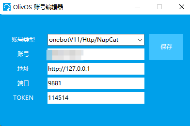

# 接入 OlivOS

本文档将教你如何把 Oopz 平台账号通过民间协议端 Oopzbot SDK 接入 [OlivOS](https://github.com/OlivOS-Team/OlivOS) 使用。

## 1. 准备 Oopz 小号

先用手机号注册一个专门给机器人使用的 Oopz 小号，并设置密码。

建议不要使用主账号作为机器人账号。

## 2. 安装运行环境

电脑需要先安装 Python 3.10 或以上版本。

安装 SDK：

```bash
pip install oopz-sdk
```

如果需要使用语音相关能力，再安装 Chromium：

```bash
python -m playwright install chromium
```

Linux 服务器如果缺少浏览器依赖，可继续执行：

```bash
python -m playwright install-deps chromium
```

验证 SDK 是否安装成功：

```bash
python -c "import oopz_sdk; print(oopz_sdk.__version__)"
```

能正常输出版本号即可。

## 3. 创建 bot.py

新建一个文件夹，新创建一个文件 `bot.py`，内容如下。

```python
import asyncio

from oopz_sdk import OopzBot, OopzConfig, OneBotV11Config, setup_logging


setup_logging("INFO")

# 从环境变量读取 Oopz 登录信息：
config = OopzConfig.from_env()

# OneBot v11 适配器配置，用于对接 OlivOS
config.onebot_v11 = OneBotV11Config(
    enabled=True,
    host="127.0.0.1",
    port=9881, # 这里以 9881 为例子，可以更改为任意端口，和 OlivOS 端配置一致即可，建议 10000-49999 之间

    # Oopz SDK 提供给 OlivOS 调用的 HTTP action 服务
    enable_http=True,

    # 本文档使用 HTTP POST 上报，不启用正向 WebSocket
    enable_ws=False,

    # HTTP TOKEN 必须与 OlivOS 端配置保持一致
    access_token="114514",

    # HTTP POST 上报签名密钥（可不填）
    secret="114514",

    # Oopz SDK 将 OneBot v11 事件上报给 OlivOS
    enable_http_post=True,
    http_post_urls=[
        # 若不多开固定为这个
        "http://127.0.0.1:55001/OlivOSMsgApi/qq/onebot/default",
    ],

    # 本文档使用 HTTP POST 上报，不启用反向 WebSocket
    enable_ws_reverse=False,

    # 保存 Oopz ID 与 OneBot 数字 ID 的映射，保持账号和消息 ID 稳定
    db_path="./data/onebot_v11.sqlite3",
)

bot = OopzBot(config)


@bot.on_ready
async def handle_ready(ctx):
    print("Oopz SDK connected successfully!")


async def main() -> None:
    try:
        await bot.run()
    finally:
        await bot.stop()


if __name__ == "__main__":
    asyncio.run(main())
```

本配置里的关键地址和端口：

| 项目 | 值 | 说明 |
| --- | --- | --- |
| Oopz SDK OneBot HTTP API | `http://127.0.0.1:9881` | OlivOS 调用 `send_msg`、`get_status` 等 action 的地址 |
| Oopz SDK HTTP API 端口 | `9881` | `bot.py` 中 `OneBotV11Config.port`，可自定义，和 OlivOS 端配置一致即可，建议 10000-49999 之间 |
| OlivOS HTTP POST 上报地址 | `http://127.0.0.1:55001/OlivOSMsgApi/qq/onebot/default` | Oopz SDK 将消息事件推给 OlivOS 的地址 |
| ID 映射数据库 | `./data/onebot_v11.sqlite3` | 保存 Oopz 与 OneBot v11 的 ID 映射 |

其中 `9881` 只是使用的示例端口，可以改成其他未被占用的端口。修改后需要同时改 `bot.py` 里的 `OneBotV11Config.port`，以及 OlivOS 中填写的 OneBot HTTP API 端口。

## 4. 启动脚本

Windows 在同文件夹下创建 `start.bat` 文件：

```bat
@echo off
chcp 65001 > nul
echo 正在配置环境变量并启动机器人...

reg add "HKCU\Console" /v VirtualTerminalLevel /t REG_DWORD /d 1 /f > nul 2>&1

set OOPZ_LOGIN_PHONE=你的电话号码
set OOPZ_LOGIN_PASSWORD=你的密码

python bot.py

echo.
pause
```

Linux 在同文件夹下创建 `start.sh` 文件：

```bash
#!/bin/bash

echo "正在配置环境变量并启动机器人..."

export OOPZ_LOGIN_PHONE="你的电话号码"
export OOPZ_LOGIN_PASSWORD="你的密码"

python3 bot.py

echo ""
read -n 1 -s -r -p "按任意键退出 . . ."
echo ""
```

Linux 首次使用前给脚本添加执行权限：

```bash
chmod +x start.sh
```

然后启动：

```bash
./start.sh
```

## 5. 首次连接 OlivOS

1. 启动 OlivOS。
2. 启动对应启动脚本。
3. 让主号在机器人小号所在的频道内随便发送一条消息。
4. 在 OlivOS 中查看是否有上报信息，并记录首次上报中显示的账号 ID 和频道 ID。

注意：因为 Oopz 和 OneBot 的 ID 模型不同，不能把所有 ID 原样透传。Oopz 的 `area + channel + message_id` 会映射成 OneBot v11 里的数字 
`group_id`、`message_id` 等字段。因此首次收到事件后，应以 OlivOS 里实际看到的账号和频道 ID 为准。
本项目将映射数据保存到：

```text
./data/onebot_v11.sqlite3
```

搭建完成后不要随意删除该文件。删除后 OneBot 数字 ID 可能重新生成，已有配置可能需要重新确认。

## 6. 退出 OlivOS 后进行配置

确认 OlivOS 已经识别到账号后，先退出 OlivOS，再按实际看到的账号信息进行配置。

需要确认的配置项：

| 配置项 | 推荐值 |
| --- | --- |
| 账号类型 | onebotv11/Http/NapCat |
| 账号 | 首次上报时 OlivOS 中显示的 ID |
| 地址 | `http://127.0.0.1` |
| 端口 | `9881`，可自定义，但必须与 `bot.py` 中你所填写的一致 |
| access token | 与 `bot.py` 中 `access_token` 一致 |



配置完成后重新启动 OlivOS 即可。OOPZ Bot 在此期间可以不关闭（当然你关了再开也行）

## 7. 验证搭建完成

启动顺序建议：

1. 先启动 OlivOS。
2. 再启动 `start.bat` 或 `start.sh`。
3. 在 Oopz 频道发送测试消息（例如）。
4. 确认 OlivOS 能收到消息并且能 OOPZ 端能正常发送。
